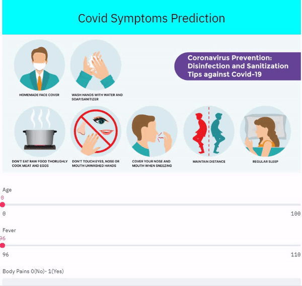

# Covid_symptoms-Prediction

1. [ Demo ](#demo)
2. [ Overview ](#overview)
3. [ Installation](#install)
4. [ Run ](#run)

### Demo

* A glimpse of the web app:

- 
#### Link of the app https://covid-symptoms.herokuapp.com/

### Overview
COVID-19 is an acute respiratory illness caused by the novel coronavirus severe acute respiratory syndrome coronavirus 2 (SARS-CoV-2).
Since its outbreak in China in December 2019, over 2,573,143 cases have been confirmed worldwide Although many people have presented with flu-like symptoms, widespread population testing is not yet available in most countries. Thus, it is important to identify the combination of symptoms most predictive of COVID-19,
to help guide recommendations for self-isolation and prevent further spread of the disease2. 
Corona Symptoms Prediction App take Input from the user and predict weather the person is having Corona Symptoms or Not.
#### User Information
- Age
- Body Temperature (Fever)
- Body Pains
- Runny Nose
- Difficulty in Breath

### Installation

The Code is written in Python 3.7. To install the required packages and libraries, run this command in the project directory after cloning the repository:

> pip install -r requirements.txt

### Run

Create an environment and clone this repository. To run this project run a command into terminal :

> streamlit run app.py

• Please do ⭐ the repository, if it helped you in anyway.
